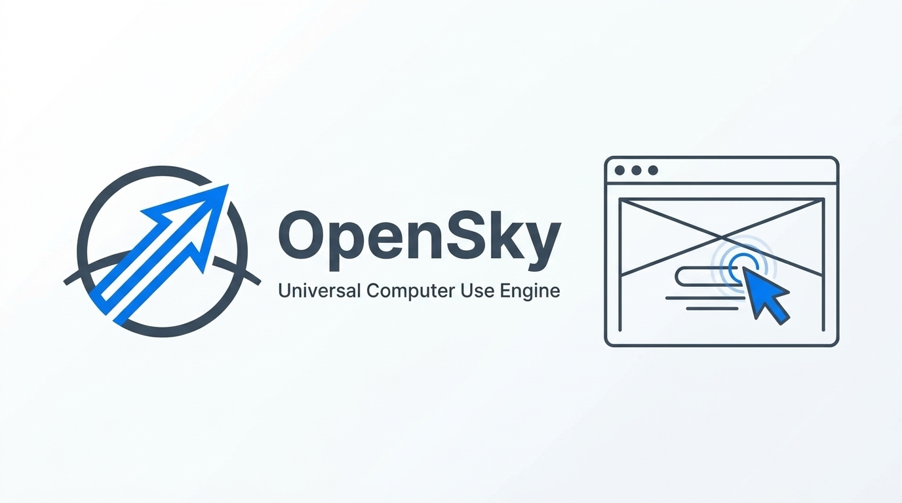

<div align="center">



# OpenSky

**Universal Computer Use Engine & MCP Server**

English | [简体中文](./README_CN.md)

</div>

OpenSky is a cross-platform Computer Use engine and Model Context Protocol (MCP) server designed to enable AI agents (such as OpenCode, Reasonix, Claude Desktop, Cursor, Antigravity, and OpenAI Codex) to automate desktop operating systems and applications.

The project currently focuses on providing a native Windows driver, while maintaining a platform-agnostic interface layer to allow future drivers for macOS and Linux.

---

## Key Design Principles

### 1. Dual-Track Interaction
- **UI Automation (Accessibility Tree)**: Parses the application control tree and assigns sequential numeric indices (e.g., `[15] Button "Submit"`). Agents can interact directly by index (`win_click(elementIndex: 15)` or `win_set_value(elementIndex: 15, value: "...")`). This approach is independent of display scaling (DPI) and eliminates the need to estimate pixel coordinates from images.
- **Visual Perception (Screenshots & Coordinates)**: Provides full-screen or window-specific screenshot capabilities. Agents can fall back to coordinate-based clicks and drags when interacting with non-standard controls, canvases, or web views.

### 2. Visual Feedback Overlay
Includes an overlay window built using Win32 layered transparent windows (`WS_EX_TRANSPARENT | WS_EX_LAYERED`):
- **Click Ripples**: Displays a temporary expanding ring animation at the click position to indicate interaction points.
- **Window Highlight**: Outlines the active target window.
- **Input Pass-Through**: The overlay does not capture focus and does not interfere with user mouse and keyboard input.

### 3. Decoupled Architecture
- **Core Engine (`src/core`)**: Defines the platform-independent `IComputerUseEngine` interface and data models.
- **Transports (`src/driver/transport`)**: Inter-process communication abstraction (STDIO, Named Pipe).
- **Platform Drivers (`src/driver`)**:
  - Windows: Split into modular micro-services for window enumeration, screen capture, accessibility tree parsing, input synthesis, and overlay rendering. Compiled using the system built-in `csc.exe`.
  - macOS / Linux: Interface ready for future platform driver implementations.
- **Adapters (`src/adapters`)**: Includes the standard MCP server, Anthropic Computer Use bridge, and Codex plugin exporter.

---

## Architecture

```
+-------------------------------------------------------------+
|                     AI Agent / Client                       |
|   (OpenCode, Reasonix, Claude Desktop, Cursor, Codex, etc.) |
+------------------------------+------------------------------+
                               |
+------------------------------v------------------------------+
|                       Adapters Layer                        |
|   - MCP Server (JSON-RPC)                                   |
|   - Anthropic Bridge (computer_20241022)                    |
|   - Codex Plugin Exporter                                   |
+------------------------------+------------------------------+
                               |
+------------------------------v------------------------------+
|                     Core Engine Interface                   |
|                     (IComputerUseEngine)                    |
+------------------------------+------------------------------+
                               |
               +---------------+---------------+
               |                               |
+--------------v---------------+ +--------------v---------------+
|        Windows Driver        | |    macOS / Linux (Planned)   |
|   (WinComputerUseHelper)     | |    (Accessibility / AT-SPI)  |
| - Window Management          | +------------------------------+
| - Screen Capture             |
| - UI Automation Tree         |
| - Input Simulation           |
| - Feedback Overlay           |
+------------------------------+
```

---

## Requirements & Building

### Requirements
- Windows 10 / 11 (64-bit)
- Node.js >= 20.0.0
- pnpm
- Built-in .NET Framework 4.8 (`csc.exe` located in `C:\Windows\Microsoft.NET\Framework64\v4.0.30319\`)

### Build Steps

```bash
# Install dependencies
pnpm install

# Compile C# native helper and bundle TypeScript code
pnpm run build

# Run automated tests
pnpm test
```

---

## Client Configuration

### OpenCode
Add OpenSky to `opencode.jsonc`:
```jsonc
{
  "mcp": {
    "opensky": {
      "type": "local",
      "command": ["node", "/path/to/opensky/dist/bin/opensky.js"]
    }
  }
}
```

### Reasonix / Google Antigravity / Cursor
The repository includes a `.mcp.json` file in the root directory, which is automatically recognized by supported clients:
```json
{
  "mcpServers": {
    "opensky": {
      "command": "node",
      "args": ["./dist/bin/opensky.js"]
    }
  }
}
```

### Claude Desktop
Add to `%APPDATA%\Claude\claude_desktop_config.json`:
```json
{
  "mcpServers": {
    "opensky": {
      "command": "node",
      "args": ["/path/to/opensky/dist/bin/opensky.js"]
    }
  }
}
```

### OpenAI Codex
Export OpenSky as a Codex plugin directory:
```bash
node dist/bin/opensky.js --export-codex ./opensky-codex-plugin
```
This generates `.codex-plugin/plugin.json`, `.mcp.json`, and `skills/opensky/SKILL.md` in the target directory.

---

## Tool Reference

| Tool Name | Parameters | Description |
| :--- | :--- | :--- |
| `win_list_windows` | None | Lists visible application windows with HWND, title, process name, and rectangle. |
| `win_activate_window` | `hwnd: number` | Brings target window to foreground and outlines it. |
| `win_screenshot` | `hwnd?: number` | Captures full desktop or target window, returning Base64 JPEG. |
| `win_get_ui_tree` | `hwnd?: number`, `maxDepth?: number` | Dumps accessibility tree with sequential element indices and discovered supported patterns. |
| `win_invoke_element` | `elementIndex: number`, `action?: string`, `value?: string` | **Zero-Cursor**: Directly triggers UI Automation Pattern (Invoke, Toggle, Select, SetValue) in memory without moving physical mouse or stealing focus. |
| `win_click` | `elementIndex?: number`, `x?: number`, `y?: number` | Clicks an indexed element or screen coordinate, triggering a visual ripple. |
| `win_double_click` | `elementIndex?: number`, `x?: number`, `y?: number` | Performs a double click. |
| `win_right_click` | `elementIndex?: number`, `x?: number`, `y?: number` | Performs a right click. |
| `win_drag` | `startX, startY, endX, endY, durationMs?` | Performs smooth mouse drag from start to end coordinates without screenshots. |
| `win_type_text` | `text: string` | Types Unicode text into the currently focused control. |
| `win_press_key` | `key: string` | Sends key or hotkey combination (e.g. `Ctrl+S`, `Enter`, `Alt+F4`, `Win+R`). |
| `win_scroll` | `deltaY: number`, `x?: number`, `y?: number` | Scrolls the mouse wheel at the specified position without screenshot overhead. |
| `win_set_value` | `elementIndex: number`, `value: string` | Sets control text directly using UI Automation ValuePattern. |

---

## License

This project is licensed under the [MIT License](./LICENSE).
